<div align="center">

# 🧠 Sistema RAG com Google Drive + Supabase + n8n

### Google Drive → Ingestão (n8n) → Embeddings (OpenAI) → Vector Store (Supabase/pgvector) → Agente conversacional com memória

<br/>


<br/>


<br/>

</div>

---

> Retrieval-Augmented Generation (RAG) aplicado na prática  
> Integração completa entre Google Drive, Supabase (Vector Store) e n8n  
> Arquitetura modular, escalável e orientada a dados

---

### 📌 Visão Geral

Este projeto implementa um **Sistema RAG (Retrieval-Augmented Generation)** utilizando:

- 📂 Google Drive como fonte de documentos
- 🧠 OpenAI para embeddings e geração de respostas
- 🗄️ Supabase (PostgreSQL + pgvector) como banco vetorial
- 🔁 n8n como orquestrador de workflows
- 💬 Agente conversacional com memória persistente

O sistema permite que um agente de IA responda perguntas com base em documentos armazenados no Google Drive.

---

### 🎯 Objetivo

Criar um sistema que:

- 📥 Monitora documentos no Google Drive
- 🔍 Extrai e processa texto automaticamente
- 🧮 Gera embeddings vetoriais
- 💾 Armazena no Supabase como banco vetorial
- 🤖 Responde perguntas usando RAG
- 🧠 Mantém memória conversacional

---

### 🏗️ Arquitetura do Sistema

#### 🔄 Fluxo Geral

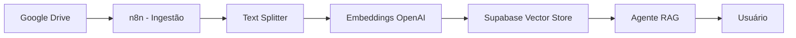
---

### 📚 Base de Conhecimento Utilizada

Para teste do sistema foi utilizado o documento:

> 📘 Princípios de Arquitetura em Aço — Coletânea do Uso do Aço (Gerdau)

**Arquivo usado como conhecimento:**  
[manual-arquitetura.docx](./arquivos/manual-arquitetura.docx)

O documento aborda:
- Conceitos estruturais
- Tipologia estrutural
- Sistemas estruturais (treliças, arcos, pórticos, estruturas mistas)
- Esforços solicitantes (flexão, cisalhamento, torção)
- Sustentabilidade do aço
- Dimensionamento estrutural

O sistema RAG permite consultar temas como:
- "O que são estruturas mistas?"
- "Explique o conceito de flambagem"
- "Quais as vantagens do aço na construção?"

---

### ⚙️ Infraestrutura
🗄️ Supabase
- PostgreSQL
- Extensão pgvector
- Tabela: documents
- Função RPC: match_documents

---

#### 📌 Infraestrutura do Banco Vetorial

A configuração detalhada do banco vetorial no Supabase está documentada neste guia:

📄 [Como criar um Banco Vetorial no Supabase (pgvector)](./docs/supabase-vector-store.md)

---

### 🔄 Workflow de Ingestão — Explicação Completa

Este workflow é responsável por:

- 📥 Baixar um documento do Google Drive  
- ✂️ Dividir o texto em partes menores  
- 🧠 Transformar o texto em vetores (embeddings)  
- 💾 Salvar tudo no banco vetorial (Supabase)  

Arquivo JSON do Workflow de Ingestão :  
[SaveFileToVectorStore.json](./fluxos-n8n/SaveFileToVectorStore.json)

---

###  1️⃣ Manual Trigger

#### 📌 O que é?
É o botão que permite iniciar o fluxo manualmente.

####  🧠 Analogia
É como apertar o botão "Iniciar" de uma máquina.

#### 📌 O que preencher?
Nada. Apenas usar para testes.

####  ❗ Por que ele existe?
Permite testar o fluxo antes de automatizar.


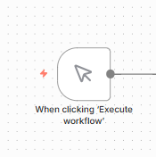

---

###  2️⃣ Set File ID (Edit Fields)

####  📌 O que é?
Define qual arquivo do Google Drive será processado.

#### 📌 O que preencher?

| Campo | Valor |
|-------|-------|
| `file_id` | ID do arquivo no Google Drive |

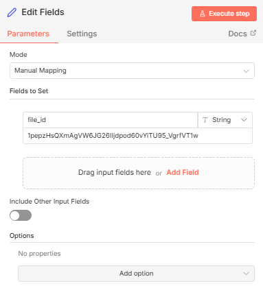

#### 🔎 Onde encontrar o file_id?

Na URL do Google Drive:

> https://drive.google.com/file/d/ID_AQUI/view

O trecho `ID_AQUI` é o `file_id`.

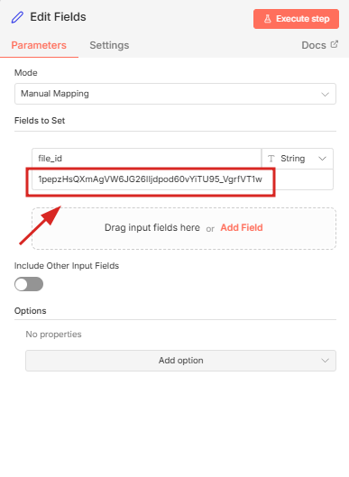
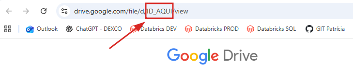


#### 🧠 Analogia
É como informar o número do livro que você quer pegar na biblioteca.

#### ❗ Se não configurar corretamente
O sistema não saberá qual documento baixar.

---

###  3️⃣ Download File (Google Drive)

#### 📌 O que faz?
Baixa o arquivo do Google Drive.

#### 📌 O que preencher?

| Campo | Valor |
|-------|-------|
| Credential | Sua conta Google (OAuth2 configurada) |
| Resource | File |
| Operation | Download |
| File | `={{ $json.file_id }}` |

#### 📌 Google File Conversion

Configure assim:

| Tipo | Converter para |
|------|----------------|
| Google Docs | Text (txt) |
| Google Sheets | CSV |
| Google Slides | MS PowerPoint ou JPG |

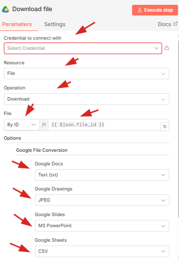

####  🧠 Por que converter para texto?
Porque a IA só entende texto.  
Ela não entende `.docx`, `.pdf` ou `.gdoc` diretamente.

#### 🧠 Analogia
É como traduzir um livro para um idioma que a máquina entende.

---

###  4️⃣ Extract From File

#### 📌 O que faz?
Transforma o arquivo baixado (binário) em texto puro.

####  📌 O que preencher?

| Campo | Valor |
|-------|-------|
| Operation | Extract From CSV ou Binary to Text |
| Input Binary Field | `data` |


####  🧠 Por que isso é necessário?
O Google envia o arquivo como um pacote fechado.  
Esse nó "abre o pacote".

#### 🧠 Analogia
Você recebeu um arquivo ZIP. Aqui você descompacta.

---

###  5️⃣ Delete Existing Rows (Supabase)

####  📌 O que faz?
Remove versões antigas do mesmo documento no banco vetorial.

#### 📌 O que preencher?

| Campo | Valor |
|-------|-------|
| Resource | Row |
| Operation | Delete |
| Table Name | documents |
| Filter | `metadata->>file_id=eq.{{ $json.file_id }}` |

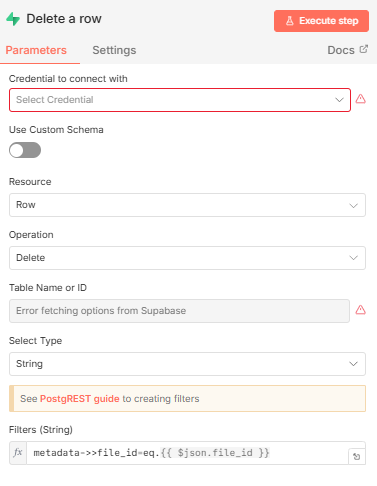

#### 🧠 O que esse filtro significa?

```sql
metadata->>file_id=eq.{{ $json.file_id }}
```
Significa:

> Apague todos os registros onde o `file_id` seja igual a este documento.

### 🧠 Por que isso é importante?

Quando você atualiza um documento no Google Drive, o conteúdo pode mudar.

Se você não apagar os registros antigos antes de salvar os novos embeddings, o banco vetorial ficará com:

- ❌ Versões antigas
- ❌ Versões novas
- ❌ Conteúdo duplicado
- ❌ Respostas inconsistentes da IA

Este nó garante que sempre exista apenas a versão mais atual do documento no banco.

#### 🧠 Analogia

É como atualizar um arquivo no seu computador:

Você apaga a versão antiga antes de salvar a nova.

---

###  6️⃣ Recursive Character Text Splitter

#### 📌 O que esse nó faz?

Divide o texto grande em partes menores chamadas **chunks**.

Modelos de IA possuem limite de tamanho de texto.  
Por isso precisamos quebrar documentos grandes em pedaços menores.

---

#### 📌 O que preencher?

| Campo | Valor recomendado |
|--------|-------------------|
| Chunk Size | 3000 |
| Chunk Overlap | 100 |

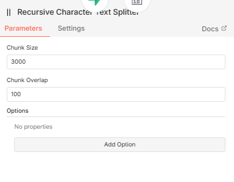

---

#### 🧠 O que significa cada campo?

#### 🔹 Chunk Size (3000)

Define o tamanho máximo de cada pedaço de texto.

Se o documento tiver 12.000 caracteres:

Ele será dividido em aproximadamente 4 partes.

---

#### 🔹 Chunk Overlap (100)

Define quantos caracteres se repetem entre um pedaço e outro.

Exemplo simplificado:

```yaml
Chunk 1:  
```
[Texto A B C D E]

```yaml
Chunk 2:  
[D E F G H]
```
"D E" se repete para manter o contexto.

---

#### 🧠 Por que repetir parte do texto?

Porque ideias podem começar no final de um pedaço e continuar no próximo.

Sem sobreposição, a IA poderia perder o sentido.

---

#### 🧠 Analogia

É como cortar um livro em capítulos menores, mas repetir um parágrafo entre eles para manter a continuidade da história.

---

### 7️⃣ Default Data Loader

#### 📌 O que esse nó faz?

Transforma o texto em um formato que o banco vetorial entende.

Ele organiza o texto como um "documento estruturado".

---

#### 📌 O que preencher?

| Campo | Valor |
|--------|--------|
| Type of Data | JSON |
| Mode | Load All Input Data |
| Text Splitting | Custom |

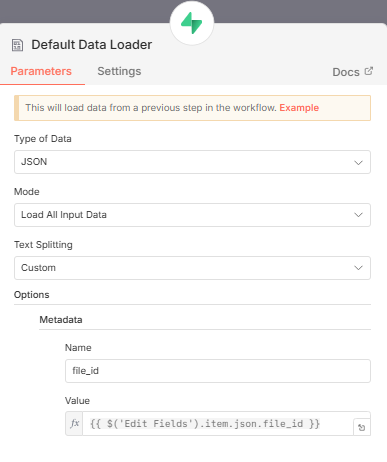

---

#### 📌 Metadata (Muito Importante)

Adicionar:

| Campo | Valor |
|--------|--------|
| Name | file_id |
| Value | `{{ $('Edit Fields').item.json.file_id }}` |

---

#### 🧠 O que é Metadata?

São informações extras que identificam de onde veio aquele pedaço de texto.

Neste caso, estamos dizendo:

> Cada pedaço de texto pertence ao documento com este file_id.

---

#### 🧠 Por que isso é essencial?

Porque depois você pode:

- Filtrar respostas por documento
- Deletar apenas um documento específico
- Rastrear a origem da informação

---

#### 🧠 Analogia

Imagine que você cortou um livro em 50 páginas soltas.

A metadata é como colocar uma etiqueta em cada página dizendo:

> "Esse pedaço pertence ao livro X"

---

### 8️⃣ Embeddings OpenAI

#### 📌 O que esse nó faz?

Transforma texto em números (vetores).

Esses números representam o significado do texto.

---

#### 📌 O que preencher?

| Campo | Valor |
|--------|--------|
| Credential | Sua chave da OpenAI |
| Model | text-embedding-3-small |

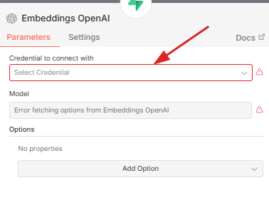

---

#### 🧠 O que é um embedding?

É uma representação matemática do significado de um texto.

Por exemplo:

- "estrutura metálica"
- "construção em aço"

Mesmo sendo frases diferentes, terão vetores parecidos.

---

#### 🧠 Analogia

É como transformar uma frase em coordenadas em um mapa invisível de significado.

---

### 9️⃣ Supabase Vector Store

#### 📌 O que esse nó faz?

Salva no banco vetorial:

- Texto original
- Embedding
- Metadata

---

#### 📌 O que preencher?

| Campo | Valor |
|--------|--------|
| Operation Mode | Insert Documents |
| Table Name | documents |
| Query Name | match_documents |

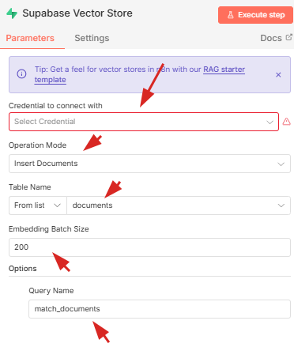

---

#### 🧠 O que é "Insert Documents"?

Significa:

> Insira novos documentos no banco vetorial.

---

#### 🧠 O que é "match_documents"?

É o nome da função que será usada depois para buscar textos semelhantes.

Essa função é chamada quando o usuário faz uma pergunta.

---

#### 🧠 O que acontece depois que tudo isso roda?

Você terá um banco vetorial que:

- Guarda o significado dos textos
- Permite busca semântica
- Responde perguntas com base no conteúdo real
- Não depende de palavras exatas

---

### 🔎 Como o RAG funciona na prática?

Quando alguém pergunta:

> "O que são estruturas mistas?"

O sistema faz:

1. Converte a pergunta em embedding
2. Busca no Supabase os vetores mais parecidos
3. Recupera os trechos relevantes
4. Envia para o GPT gerar a resposta final

---

### 🎯 Resultado Final

Você criou uma base de conhecimento inteligente.

Não é apenas armazenamento de texto.

É armazenamento de significado.

Isso é a base de qualquer sistema moderno de IA com RAG.

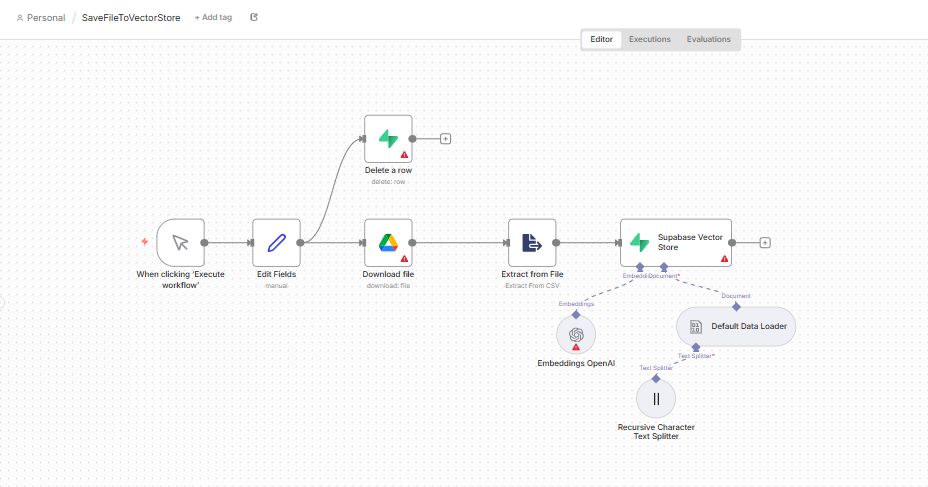

---

### 🤖 Workflow 2 — Agente Conversacional (RAG na prática)

Este workflow é responsável por:

- 💬 Receber perguntas do usuário
- 🔎 Buscar trechos relevantes no banco vetorial
- 🧠 Gerar respostas com base nos documentos
- 📝 Manter memória da conversa

Agora saímos da fase de "armazenar conhecimento"  
e entramos na fase de **usar o conhecimento**.

---

#### 🧠 Visão Geral do Funcionamento

Quando alguém faz uma pergunta:

1. A pergunta vira embedding
2. O sistema busca textos parecidos no Supabase
3. Recupera os trechos mais relevantes
4. Envia tudo para o GPT
5. O GPT responde com base nesses trechos

Isso é RAG (Retrieval-Augmented Generation).

---

#### 🔄 Estrutura do Workflow

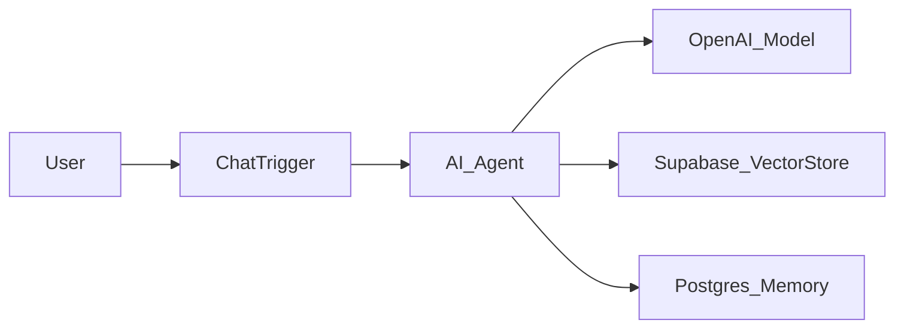

###  1️⃣ Chat Trigger

#### 📌 O que é?

É o ponto de entrada do usuário no sistema.

Sempre que alguém envia uma mensagem no chat, é esse nó que recebe a pergunta e inicia o fluxo do agente.

Sem ele, o sistema não teria como “ouvir” o usuário.

---

#### 📌 O que preencher?

Normalmente não é necessário configurar campos complexos.

Você apenas precisa:

- Ativar o nó
- Garantir que ele esteja conectado ao AI Agent

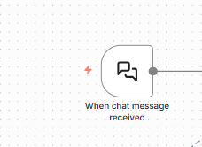

---

#### 🧠 Analogia

Imagine que o sistema é um prédio.

O Chat Trigger é a recepção.

Toda pergunta passa primeiro por ele antes de ser encaminhada para o “cérebro”.

---

###  2️⃣ AI Agent

#### 📌 O que é?

É o cérebro coordenador do sistema.

Ele:

- Recebe a pergunta
- Decide usar o banco vetorial
- Usa memória da conversa
- Envia contexto para o GPT
- Gera a resposta final

---

#### 📌 O que preencher?

| Campo | Valor |
|--------|--------|
| Model Provider | OpenAI |
| Model | gpt-4 ou gpt-4.1-mini |
| Memory Type | PostgreSQL |
| Session ID | `={{ $json["session_id"] || $executionId }}` |

---

#### 🧠 O que significa cada item?

### 🔹 Model

É o modelo responsável por gerar a resposta final.

Ele não busca informações sozinho — ele responde com base no que o sistema envia.

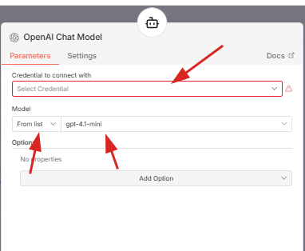

---

#### 🔹 Memory Type (PostgreSQL)

Define onde o histórico da conversa será salvo.

Nesse caso:

- Supabase (PostgreSQL)

---

#### 🔹 Session ID

Identifica cada conversa individualmente.

Isso permite que:

- Usuário A tenha contexto próprio
- Usuário B tenha outro contexto separado

---

#### 🧠 Analogia

O AI Agent é como um gerente:

Ele consulta arquivos,
consulta histórico,
organiza tudo
e responde.

---

###  3️⃣ Supabase Vector Store (Retrieve as Tool)

#### 📌 O que é?

É o mecanismo de busca inteligente do sistema.

Ele procura no banco vetorial os trechos mais parecidos com a pergunta do usuário.

---

#### 📌 O que preencher?

| Campo | Valor |
|--------|--------|
| Mode | retrieve-as-tool |
| Table Name | documents |
| TopK | 10 |
| Query Name | match_documents |

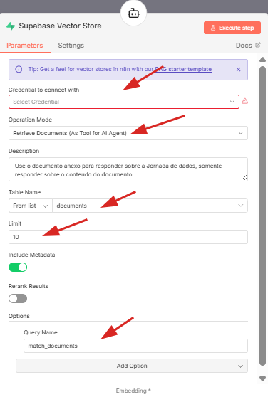

---

#### 🧠 O que significa TopK?

Define quantos trechos relevantes serão recuperados.

Exemplo:

Se TopK = 10  
O sistema trará os 10 trechos mais parecidos semanticamente.

---

#### 🧠 Analogia

Se você perguntar:

> "O que são estruturas mistas?"

O sistema vai até a estante e pega os 10 parágrafos mais próximos desse assunto.

---

###  4️⃣ Embeddings OpenAI (na consulta)

#### 📌 O que faz?

Transforma a pergunta do usuário em números (vetores).

Esses números são usados para comparar com os vetores armazenados no banco.

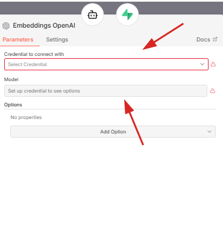

---

#### 🧠 Importante

Aqui os embeddings não geram resposta.

Eles apenas permitem a busca por significado.

---

#### 🧠 Analogia

É como converter sua pergunta em coordenadas em um mapa invisível.

O banco vetorial encontra os pontos mais próximos.

---

###  5️⃣ Postgres Chat Memory

#### 📌 O que é?

É o histórico da conversa.

Permite que o sistema lembre o que já foi dito.

---

#### 📌 O que preencher?

| Campo | Valor |
|--------|--------|
| Credential | Supabase |
| Session ID | Mesmo ID usado no AI Agent |

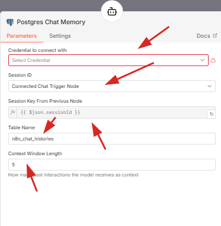

---

#### 🧠 O que isso permite?

Perguntas como:

> "Explique melhor isso"

Sem precisar repetir o assunto.

---

#### 🧠 Analogia

Sem memória:
Cada pergunta seria isolada.

Com memória:
O sistema entende o contexto da conversa.

---

#### 🔎 O que acontece quando alguém faz uma pergunta?

Exemplo:

> "Quais são os sistemas estruturais?"

O sistema faz:

1️⃣ Converte a pergunta em embedding  
2️⃣ Busca vetores parecidos no Supabase  
3️⃣ Recupera os trechos mais relevantes  
4️⃣ Envia tudo para o GPT  
5️⃣ GPT gera a resposta final  

---

#### 📌 Sobre o System Prompt

Você pode configurar algo como:
- Responda apenas com base no conteúdo do documento.
- Se não estiver no documento, diga que não encontrou.


Isso evita que a IA invente informações.

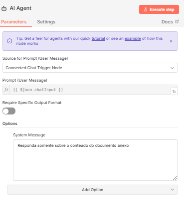

---

####  🎯 Resultado Final

Você criou um agente que:

- 🔎 Busca por significado, não por palavra-chave
- 📚 Responde com base nos seus documentos
- 🧠 Mantém memória
- 💬 Entende contexto
- 🚀 Funciona em tempo real

Isso é um sistema RAG completo.

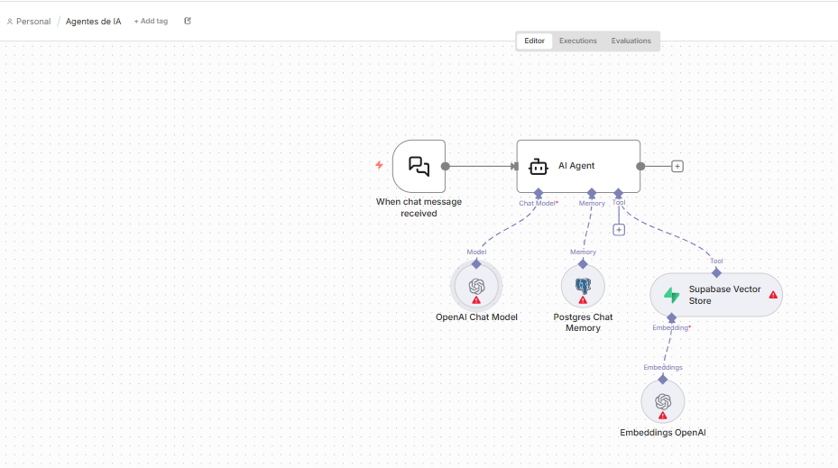

---

### 🔎 Como o RAG Funciona (Explicado de Forma Simples)

RAG significa:

> Retrieval-Augmented Generation  
> (Geração de Resposta com Recuperação de Contexto)

Ele funciona em 4 etapas principais:

---

#### 📌 Passo 1 — A pergunta vira embedding

Quando o usuário faz uma pergunta:
- "O que são estruturas mistas?"
 

O sistema transforma essa frase em um vetor numérico.

Esse vetor representa o significado da pergunta.

---

#### 📌 Passo 2 — Busca vetorial no banco

O Supabase compara esse vetor com os vetores armazenados.

Ele não procura palavras iguais.  
Ele procura significados parecidos.

Isso permite encontrar:

- Textos que falam do mesmo assunto
- Mesmo que usem palavras diferentes

---

#### 📌 Passo 3 — Recupera os trechos mais relevantes

O sistema seleciona os trechos mais próximos semanticamente (TopK).

Esses trechos são enviados junto com a pergunta para o GPT.

---

#### 📌 Passo 4 — GPT gera resposta contextualizada

Agora o GPT responde usando:

- A pergunta
- Os trechos recuperados
- O histórico da conversa

Resultado:

Uma resposta baseada no seu documento, e não apenas no conhecimento geral do modelo.

---

### 🧠 Diferença entre IA comum e RAG

| IA Comum | IA com RAG |
|-----------|------------|
| Responde com base no treinamento geral | Responde com base nos seus documentos |
| Pode alucinar | Reduz drasticamente alucinação |
| Não tem acesso aos seus arquivos | Usa seu banco vetorial |
| Não é auditável | Permite rastrear origem da informação |

---

### 📊 Conceitos Técnicos Implementados

Este projeto implementa conceitos modernos de arquitetura de IA:

- 🔢 Vetorização semântica (Embeddings)
- ✂️ Chunking recursivo com sobreposição
- 🏷️ Metadata filtering (file_id)
- 🗄️ Supabase RPC search (match_documents)
- 🧠 Conversational memory via PostgreSQL
- 🔁 Orquestração de fluxo via n8n
- 🧩 Arquitetura desacoplada (Ingestão ≠ Consulta)
- 📚 Separação entre armazenamento e geração

---

### 🏗️ Arquitetura em Camadas

O sistema foi estruturado em camadas bem definidas:

1️⃣ Camada de Ingestão  
2️⃣ Camada de Vetorização  
3️⃣ Camada de Armazenamento  
4️⃣ Camada de Recuperação  
5️⃣ Camada de Geração (LLM)  
6️⃣ Camada de Memória  

Essa separação permite:

- Escalabilidade
- Manutenção simplificada
- Evolução independente de cada camada

---

### 🧠 Conceitos de Engenharia Aplicados

Inspirado em princípios estruturais do documento técnico utilizado como base de conhecimento, este projeto não foi construído apenas como um fluxo funcional, mas como uma arquitetura organizada e modular.

Assim como na engenharia estrutural, onde cada elemento possui função definida e trabalha em conjunto para garantir estabilidade, este sistema RAG foi projetado com separação clara de responsabilidades.

---

### 🏗️ Paralelo entre Engenharia Estrutural e Arquitetura de Software

| Engenharia Estrutural | Arquitetura do Sistema RAG |
|-----------------------|----------------------------|
| Nós | Conexões entre serviços (APIs, integrações) |
| Barras | Fluxos de dados |
| Lâminas | Interfaces e camadas de processamento |
| Fundação | Banco vetorial (Supabase) |
| Sistema estrutural | Arquitetura completa do RAG |

---

### 🔎 Hierarquia Estrutural Aplicada ao Sistema

Na engenharia, as cargas seguem um caminho hierárquico até a fundação.

No sistema RAG, o fluxo segue uma hierarquia semelhante:

1️⃣ Entrada do usuário (Chat Trigger)  
2️⃣ Processamento da pergunta (Embeddings)  
3️⃣ Recuperação no banco vetorial  
4️⃣ Geração da resposta (LLM)  
5️⃣ Persistência de contexto (Memória)  

Essa organização reduz acoplamento e melhora escalabilidade.

---

### 🧩 Modularidade

Cada parte do sistema é independente:

- Ingestão ≠ Consulta  
- Embedding ≠ Geração  
- Armazenamento ≠ Memória  

Isso permite:

- Substituir modelos de IA facilmente  
- Trocar o banco vetorial  
- Escalar componentes separadamente  

---

### ⚙️ Separação de Responsabilidades

Cada nó possui função clara:

- Google Drive → Fonte de dados  
- Text Splitter → Preparação de dados  
- Embeddings → Representação semântica  
- Supabase → Persistência vetorial  
- GPT → Geração de linguagem  
- Postgres → Memória conversacional  

Essa separação é característica de arquiteturas profissionais.

---

### 📐 Arquitetura em Camadas

O sistema foi organizado em camadas lógicas:

#### 1️⃣ Camada de Ingestão
Responsável por buscar e preparar documentos.

#### 2️⃣ Camada de Vetorização
Responsável por transformar texto em representação matemática.

#### 3️⃣ Camada de Armazenamento
Banco vetorial que guarda significado.

#### 4️⃣ Camada de Recuperação
Busca semântica (RPC match_documents).

#### 5️⃣ Camada de Geração
Modelo LLM responsável pela resposta final.

#### 6️⃣ Camada de Memória
Persistência de contexto por sessão.

---

### 🔐 Robustez e Evolução

Assim como uma estrutura bem dimensionada permite ampliações futuras, esta arquitetura permite:

- Adicionar múltiplos documentos
- Implementar versionamento
- Criar controle de acesso por usuário
- Adicionar monitoramento e observabilidade
- Integrar múltiplos modelos de IA

---

### 📈 Possíveis Evoluções

Este projeto pode evoluir para:

- 🔄 Atualização automática via Google Drive Trigger
- 📚 Multi-document RAG
- 🕒 Versionamento vetorial
- 🌐 Interface Web dedicada
- 🐳 Deploy com Docker
- ☁️ Deploy em ambiente cloud escalável
- 🧠 Multi-model routing (roteamento inteligente por tipo de pergunta)
- 📊 Observabilidade (logs, métricas, custo por consulta)
- 🔐 Controle de autenticação por usuário

---

### 🚀 Resultado Final

Você construiu:

✅ Um sistema RAG funcional  
✅ Banco vetorial escalável  
✅ Agente conversacional com memória persistente  
✅ Integração real com Google Drive  
✅ Arquitetura modular desacoplada  
✅ Pipeline completo de ingestão e consulta  
✅ Base pronta para evoluir para produto real  

---

### 🏁 Conclusão

Este projeto demonstra:

- Engenharia de Dados aplicada à IA  
- Arquitetura moderna de sistemas LLM  
- Implementação prática de RAG  
- Integração entre múltiplos serviços  
- Organização estrutural profissional  

Não é apenas um fluxo no n8n.

É uma arquitetura completa de IA baseada em documentos.