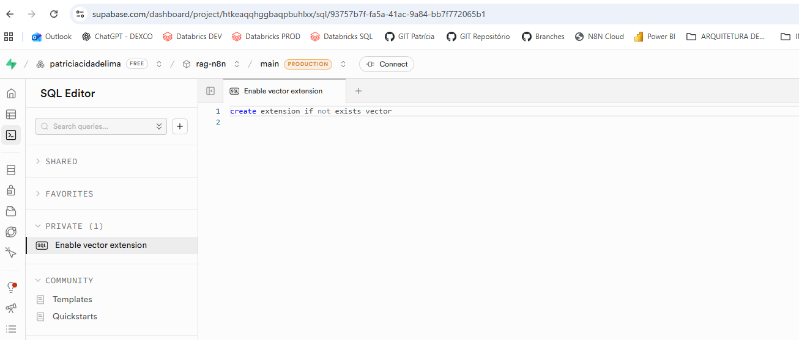
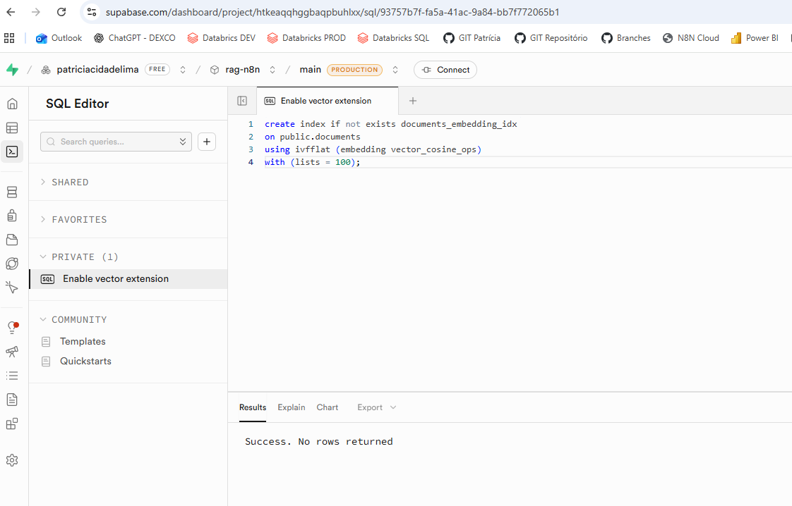

# 📄 Como criar um Banco Vetorial no Supabase (pgvector)

Este documento é um guia completo para configurar no Supabase a estrutura necessária para armazenar **embeddings (vetores)** e realizar **busca vetorial**, base de qualquer sistema **RAG (Retrieval-Augmented Generation)**.

---

## ✅ O que você vai criar no Supabase

Ao final deste guia você terá:

- Extensão **pgvector** habilitada
- Tabela `documents` para armazenar:
  - texto (`content`)
  - embedding (`embedding`)
  - metadados (`metadata`)
- Função RPC `match_documents` para busca semântica
- Índice vetorial para performance
- Configuração pronta para integração com n8n

---

## 🧠 O que é um Banco Vetorial?

Um banco vetorial armazena o **significado** do texto.

Fluxo básico:

1. Texto → vira **embedding** (lista de números)
2. Esses números são armazenados no banco
3. Pergunta do usuário → vira embedding (lista de números)
4. O banco encontra vetores mais próximos

✅ Resultado: busca por **significado**, não por palavra-chave.

---

## 1️⃣ Criar projeto no Supabase

1. Acesse: https://supabase.com  
2. Clique em **New project**  
3. Configure:
   - Nome do projeto (ex: `rag-n8n`)
   - Senha do Postgres (guarde em local seguro)
   - Região (prefira a mais próxima)

Após criar, acesse o **SQL Editor**.

---

## 2️⃣ Ativar a extensão pgvector

No **SQL Editor**, execute:

    create extension if not exists vector;

✅ Isso habilita o tipo `vector`, usado para armazenar embeddings.

---

## 3️⃣ Criar a tabela `documents`

No **SQL Editor**, execute:

    create table if not exists public.documents (
      id bigserial primary key,
      content text not null,
      metadata jsonb default '{}'::jsonb,
      embedding vector(1536),
      created_at timestamptz default now()
    );

### 🧠 O que significa cada coluna?

- `id`: identificador único de cada trecho
- `content`: texto do documento (chunk)
- `metadata`: informações extras (ex: `file_id`, origem, nome do arquivo)
- `embedding`: vetor numérico que representa o significado do texto
- `created_at`: data de inserção

⚠️ Importante: o tamanho do vetor (`vector(1536)`) depende do modelo de embedding.  
Se aparecer erro de “tamanho diferente”, ajuste a dimensão (ver seção **Solução de Problemas**).

---

## 4️⃣ Criar a função RPC `match_documents`

Essa função faz a busca vetorial (por similaridade).

No **SQL Editor**, execute:

    create or replace function public.match_documents(
      query_embedding vector(1536),
      match_count int default 10,
      filter jsonb default '{}'::jsonb
    )
    returns table (
      id bigint,
      content text,
      metadata jsonb,
      similarity float
    )
    language plpgsql
    set search_path = public
    as $$
    begin
      return query
      select
        d.id,
        d.content,
        d.metadata,
        1 - (d.embedding <=> query_embedding) as similarity
      from public.documents d
      where d.metadata @> filter
      order by d.embedding <=> query_embedding
      limit match_count;
    end;
    $$;

### 🧠 Explicação simples dos parâmetros

- `query_embedding`: vetor da pergunta do usuário
- `match_count`: quantos trechos retornar (TopK)
- `filter`: filtro opcional por metadata (ex: `{"file_id":"..."}`)

### 🧮 Como funciona o cálculo de similaridade?

A parte:

    d.embedding <=> query_embedding

calcula a **distância entre vetores**.

- **Menor distância** → mais parecido semanticamente  
- **Maior distância** → menos parecido  

O banco usa essa distância para ordenar os resultados do mais relevante para o menos relevante.

---

## 5️⃣ Criar índice vetorial (performance)

Sem índice, a busca pode ficar lenta conforme o banco cresce.

Execute:

    create index if not exists documents_embedding_idx
    on public.documents
    using ivfflat (embedding vector_cosine_ops)
    with (lists = 100);

### 🧠 Sobre `lists`

Controla qualidade x velocidade:

- maior = mais preciso (porém mais custo)
- menor = mais rápido (porém menos preciso)

Para começar, `100` é um bom valor.

> 💡 Dica: o índice `ivfflat` costuma performar melhor quando a tabela já possui um volume mínimo de dados.  
> Se estiver testando com poucos registros, você pode criar o índice após inserir alguns documentos.

### 🧠 Sobre `vector_cosine_ops`

Estamos utilizando **Cosine Similarity**, que mede o ângulo entre vetores.

Por que usar Cosine?

- Funciona melhor para embeddings de linguagem natural
- Mede direção, não magnitude
- É padrão para busca semântica com LLMs

Alternativas possíveis:

- `vector_l2_ops` (distância euclidiana)
- `vector_ip_ops` (inner product)

Para RAG com OpenAI, Cosine é recomendado.

---

## 6️⃣ Credenciais do Supabase para o n8n

Para conectar o Supabase ao n8n, você precisará de:

- **Project URL** (Supabase → Settings → API)
- **Service Role Key** (Supabase → Settings → API → `service_role`)

⚠️ Importante:

- Use a **Service Role Key apenas no backend (n8n)**.
- Nunca exponha essa chave no frontend.
- Ela possui acesso total ao banco.

No n8n configure:

- Host → Project URL
- API Key → Service Role Key
- Table → `documents`
- Query Name → `match_documents`

---

## 7️⃣ (Opcional) Row Level Security (RLS)

Se você usa autenticação do Supabase e quer controlar acesso, habilite RLS.

> Se você usa apenas o n8n com service key, talvez não precise.

Ativar RLS:

    alter table public.documents enable row level security;

Policy simples de leitura (exemplo):

    create policy "allow read"
    on public.documents
    for select
    to public
    using (true);

---

## 8️⃣ Testes rápidos no Supabase

### 8.1) Inserir registro manual (teste)

    insert into public.documents (content, metadata, embedding)
    values (
      'Texto de teste sobre estruturas metálicas.',
      '{"file_id": "teste"}',
      array_fill(0.01::float, array[1536])::vector
    );

> Isso não é um embedding real, mas serve para validar se a tabela e o tipo `vector` estão funcionando.

### 8.2) Consultar por `file_id`

    select id, content, metadata
    from public.documents
    where metadata->>'file_id' = 'teste';

---

## ✅ Checklist final

- [ ] Projeto criado no Supabase
- [ ] Extensão `vector` habilitada
- [ ] Tabela `documents` criada
- [ ] Função `match_documents` criada
- [ ] Índice vetorial criado
- [ ] n8n configurado com:
  - [ ] Table: `documents`
  - [ ] Query Name: `match_documents`

---

## 🧩 Solução de Problemas

### ❌ Erro: vector size mismatch / dimensão incompatível

Isso acontece quando a dimensão do vetor gerado pelo modelo não bate com:

    embedding vector(1536)

Corrija:

    alter table public.documents
    alter column embedding type vector(N);

Substitua `N` pela dimensão correta do seu embedding.

---

## 🚀 Otimização adicional

Após criar o índice, execute:

    analyze public.documents;

Para ambiente de produção:

    vacuum analyze public.documents;

Isso mantém:

- Estatísticas atualizadas
- Índices otimizados
- Performance estável

---

## 📌 Referências internas do repositório

1. Workflow de Ingestão: `fluxos-n8n/SaveFileToVectorStore.json`
2. Workflow Conversacional: `fluxos-n8n/Agentes de IA.json`
3. Documento base (conhecimento): `arquivos/manual-arquitetura.docx`

---

## 📌 Referências Oficiais

- Supabase – pgvector: https://supabase.com/docs/guides/database/extensions/pgvector  
- pgvector (GitHub): https://github.com/pgvector/pgvector  
- Supabase RPC Functions: https://supabase.com/docs/guides/database/functions  
- OpenAI Embeddings: https://platform.openai.com/docs/guides/embeddings  

---

## ⚠️ Observação sobre dimensão do embedding

Exemplos comuns:

- `text-embedding-3-small` → 1536
- `text-embedding-3-large` → 3072

Se a dimensão do banco não corresponder ao modelo, você verá:

    vector size mismatch

Sempre confirme a dimensão antes de criar a tabela.

---

## 🏁 Conclusão

Com essa configuração você possui:

- Banco vetorial funcional
- Busca semântica configurada
- Estrutura pronta para RAG
- Performance otimizada
- Arquitetura alinhada com padrões modernos de IA

Seu Supabase agora está preparado para atuar como camada de recuperação semântica em sistemas de IA baseados em documentos.